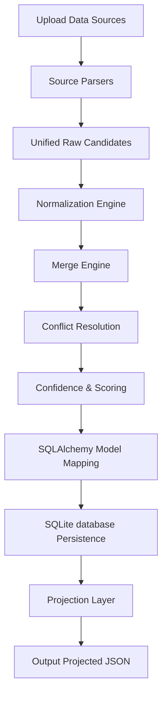

# Enterprise Candidate Data Transformer

A professional, modular FastAPI and Python application that parses candidate information from multiple source files (recruiter CSV, PDF/DOCX Resumes, TXT Notes, and GitHub profiles), normalizes fields (phone numbers, dates, countries, emails, and skills), merges records into a single canonical profile, resolves single-value conflicts using a strict priority queue, tracks data provenance, and projects the final output using a client-supplied configuration schema.

---

## Technical Stack & Libraries

- **Framework**: FastAPI (Python 3.10+)
- **Database**: SQLite (SQLAlchemy 2.0 ORM)
- **Data & Text Parsing**:
  - `pandas`: Reads recruiter CSVs.
  - `pdfplumber`: Extracts text from PDF resumes.
  - `python-docx`: Extracts text from Word (DOCX) resumes.
  - `httpx`: Accesses GitHub REST API for profile details and public repo languages.
- **Normalization**:
  - `phonenumbers`: Standardizes phone formats to E.164.
  - `python-dateutil`: Parses unstructured date strings.
  - `pycountry`: Normalizes country names.
- **Diagnostics & Quality**:
  - `loguru`: Application logging (console + request-local interceptor for UI display).
  - `pytest`: Complete test coverage.

---

## Directory Structure

```text
candidate-transformer/
│
├── app/
│   ├── main.py               # FastAPI router and lifecycle handlers
│   ├── models/
│   │   ├── db_models.py      # SQLAlchemy candidate models
│   │   └── schemas.py        # Pydantic v2 schemas and configs
│   ├── parsers/
│   │   ├── base.py           # Abstract parser base class
│   │   ├── csv_parser.py     # pandas recruiter CSV parser
│   │   ├── resume_parser.py  # PDF and DOCX resume parser
│   │   ├── txt_parser.py     # Recruiter notes TXT parser
│   │   └── github_parser.py  # GitHub REST API user parser
│   ├── pipeline/
│   │   ├── normalization.py   # Phone, Date, Country, Email, and Skill normalization
│   │   ├── merge_engine.py    # List consolidation and education/experience deduplication
│   │   ├── conflict_resolver.py # Core priority conflict resolver (GitHub > Resume > CSV > TXT)
│   │   ├── confidence_engine.py # Corroboration & completeness scorer
│   │   └── projection.py      # Output field selector, renamer, and missing-value handler
│   ├── database/
│   │   └── connection.py     # SessionLocal and DB engine setup
│   ├── templates/
│   │   └── index.html        # HTML User Interface
│   ├── static/
│   │   ├── css/
│   │   │   └── styles.css    # Responsive premium stylesheet
│   │   └── js/
│   │       └── app.js        # Form and response controller
│   └── utils/
│       └── logging.py        # Loguru request-local logging setup
│
├── uploads/                  # Directory storing uploaded raw files
├── output/                   # Directory saving generated projected JSON outputs
├── tests/                    # Unit & Integration tests directory
├── requirements.txt
├── README.md
└── .env
```

---

## Installation & Setup

### 1. Prerequisites
- Python 3.10 or higher.

### 2. Database Initialization
SQLite requires no database creation. The database file `candidate_transformer.db` will be created automatically in the root of the project directory when the application starts.

### 3. Setup Virtual Environment & Install Dependencies
Navigate to the directory `candidate-transformer/` and run:
```bash
# Create Virtual Environment
python -m venv .venv

# Activate Virtual Environment (PowerShell)
.\.venv\Scripts\Activate.ps1
# Or Command Prompt:
# .venv\Scripts\activate.bat
# Or Linux/macOS:
# source .venv/bin/activate

# Install requirements
pip install -r requirements.txt
```

### 4. Environment Configuration
Create a `.env` file in the root folder (or copy `.env.example`):
```ini
DATABASE_URL=sqlite:///./candidate_transformer.db
UPLOAD_DIR=uploads
OUTPUT_DIR=output
LOG_LEVEL=INFO
# Optional: Add GitHub token to prevent API rate-limit errors
# GITHUB_TOKEN=ghp_yourpersonaltokenhere
```

### 5. Running the Application
Start the Uvicorn dev server:
```bash
uvicorn app.main:app --reload
```
Open [http://127.0.0.1:8000](http://127.0.0.1:8000) in your browser to interact with the single-page UI.

---

## Core Pipeline Architecture



1. **Upload Files**: Saves the CSV, PDF/DOCX resumes, or notes to the local `uploads/` directory, and registers metadata in SQLite.
2. **Parsing**: Individual modules extract content into a standard internal `RawCandidate` model.
3. **Normalization**: Phone numbers become E.164 (`+15555555555`), dates standardize to ISO (`YYYY-MM-DD`), countries normalize using ISO standards (via `pycountry`), emails validate and lowercase.
4. **Merging**: Aggregates lists of skills, emails, and phone numbers. Dedupes experiences/educations using exact-signature matching.
5. **Conflict Resolution**: Multi-source values for single-value fields (e.g. Name, Country) resolve using a strict priority order: **GitHub > Resume > Recruiter CSV > TXT Notes**. Provenance details are recorded for every single field value.
6. **Confidence Engine**: Calculates a corroboration-based confidence metric for each field, compiling a weighted average for the overall profile confidence score.
7. **Projection**: Formats the final output JSON according to instructions in the Projection Configuration JSON (filtering keys, renaming headers, embedding/stripping confidence metrics, and applying default fallbacks for missing values).
